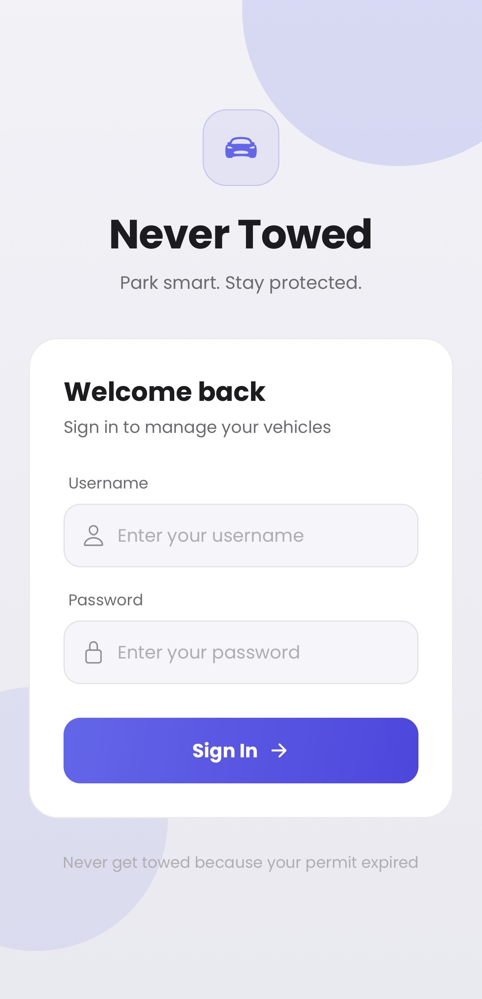
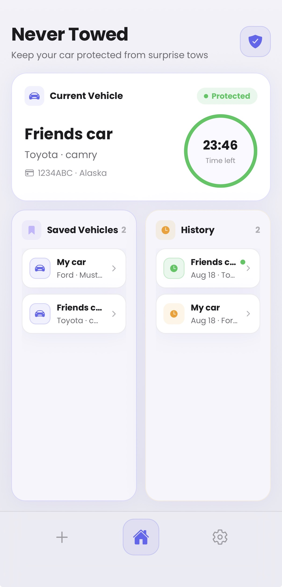
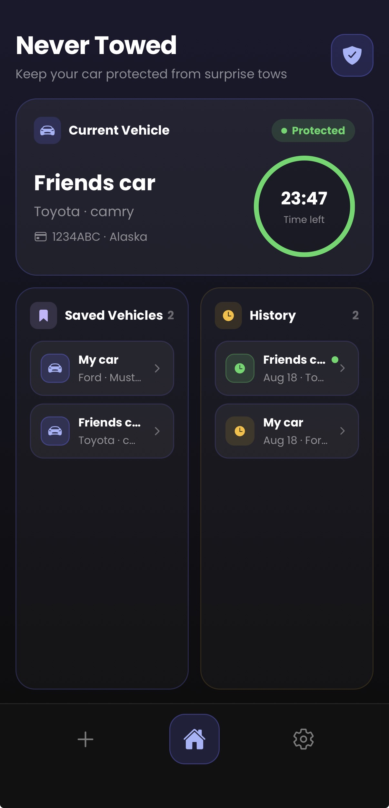
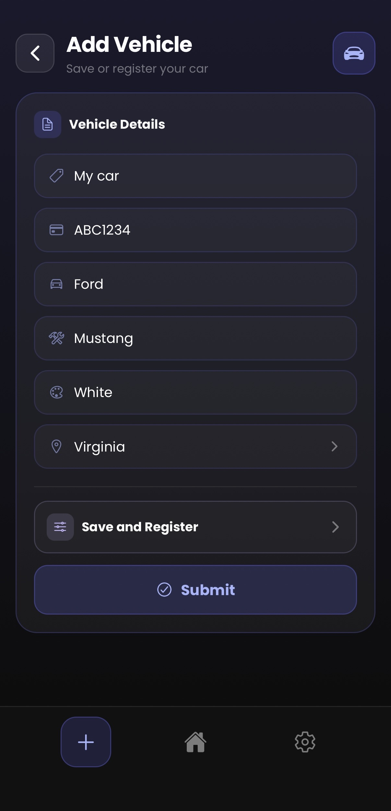
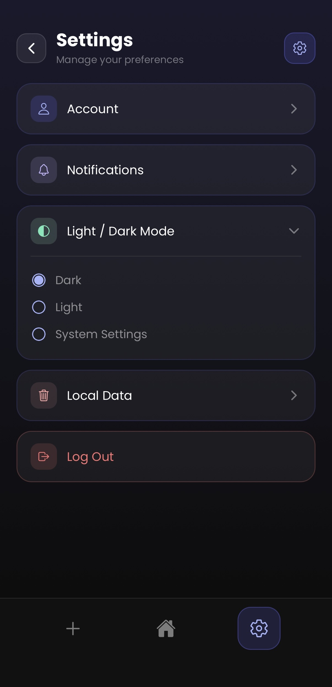
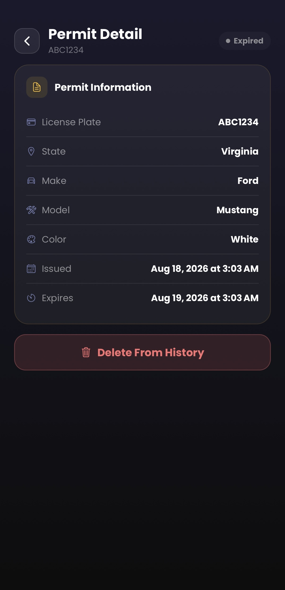

NeverTowed

React Native (Expo) iOS app that automates parking permit registration. Built this because my apartment's parking system makes you manually re-register your guest vehicles every 24 hours. Without a push notification or the exact time the registration expires, the chances of forgetting to register the vehicle — and facing a towing fee — grows exponentially.

> You can either configure it to your own parking system, or use the custom API in my repo [here](https://github.com/av-chris/Never-Towed-API)

## Screenshots

| Login | Home (Light) |
| :---- | :---- |
| |  |

| Home (Dark) | Add Vehicle |
| :---- | :---- |
| | |

| Settings | Permit Detail |
| :---- | :---- |
|  |  |

## What it does

- Save a vehicle once, register it in one tap
- Live countdown of how much time is left on your permit
- Stays logged in — no re-entering credentials
- Push notifications before your permit expires *(in progress)*
- Server-side auto-renewal, so it renews itself even if the app's closed *(in progress)*

## Who it's for

Apartment residents whose community uses a parking system with a repetitive, unforgiving registration process — no saved vehicles, no expiration warnings, just a manual daily chore. Secondarily, and my personal reason, frequent guests who need a vehicle registered regularly without redoing the same data entry every time.

## What it's not trying to be

- Not a replacement for the parking provider's own system — it's a companion layer on top of it
- Not built for multiple residents or properties per account
- No payment processing
- Not plug-and-play for non-technical users — it requires configuring API credentials for whatever provider you're connecting to
- Doesn't do anything the provider's own system doesn't already support (e.g. can't edit a permit that's already been issued)

## How it works

Start by forking this repo on GitHub, then clone your fork down locally with `git clone <your-fork-url>` and `cd` into it. Run `npm install` to pull in all the dependencies, then `npx expo start` to spin up the Expo dev server — that opens a terminal with a QR code and a small menu of commands. From there, press `i` to launch it in the iOS Simulator if you have Xcode installed, or scan the QR code with the Expo Go app on your phone to run it on a real device. Since this repo ships with a mock backend instead of real provider credentials, it'll boot and run immediately without any extra config — you're just exploring against realistic fake data out of the box.

Most parking provider apps don't have a public or documented API — but that doesn't mean you can't figure out how they work. Tools like mitmproxy let you sit between your phone and the internet and watch the exact traffic the provider's own app sends: every endpoint, header, and auth flow, in plain text.

Doing that against a live, real provider's API without their permission sits in a legal gray area, so I won't explain the exact way to do this — the specifics of what I found for this particular provider, exact endpoints, headers, auth flow, live in a private repo I'm not sharing publicly. This repo is meant to give you a working simulation of a real parking system you can run and explore on your own, use as a base foundation if you're developing something similar for your own parking system, or follow the same approach I did to connect it to a real provider of your own.

## Tech

Using: React Native (Expo), SQLite, JWT auth, mitmproxy for the API reverse engineering.

Building: Backend (Node/Express + cron auto-renewal), notification system.

## Status

Core app works end-to-end against the real provider API — login, saved vehicles, registration, countdown. Still building: push notifications, the auto-renewal system, a confirmation screen, and a couple minor UI fixes.

---

Christopher Alvarez — [github.com/av-chris](https://github.com/av-chris)
